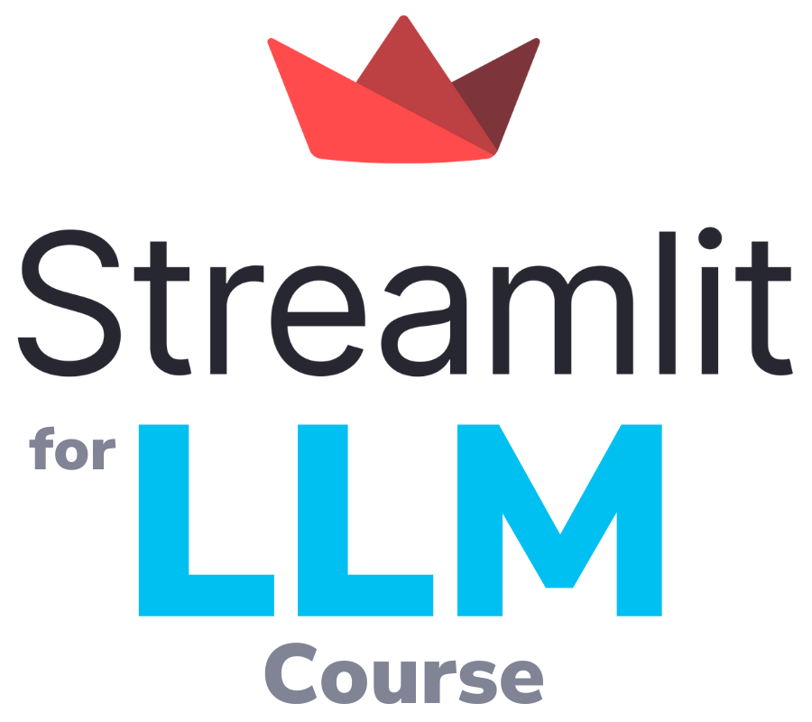

<p align="center">
  
</p>

## About
> The *Generative AI* course will show you how to use Streamlit to build large language model (LLM) powered apps. Finally you can deploy the Streamlit app to the cloud and share with the community.
>
### About the Course:
The Generative AI course offers a comprehensive guide on utilizing Streamlit to develop large language model (LLM) powered applications.

### Course Objectives:
Learn to leverage Streamlit for building interactive and user-friendly LLM-powered apps.
Gain insights into utilizing various Python libraries for Generative AI, including OpenAI and Hugging Face.
Understand the process of deploying Streamlit apps to the cloud and sharing them with the community.

### Overview:
The course consists of lessons covering different aspects of Streamlit and Generative AI, along with hands-on projects aimed at practical application of the concepts learned.

## Table of contents
- [**Lesson 0** - Getting up to speed with Streamlit](./content/Lesson-0.md)
- [**Lesson 1** - An introduction to Generative AI](./content/Lesson-1.md)
- [**Lesson 2** - Using LLM models from OpenAI](./content/Lesson-2.md)
- [**Lesson 3** - Using open source LLM models from Hugging Face Hub](./content/Lesson-3.md)
- [**Lesson 4** - Using hosted open source LLM models from Replicate](./content/Lesson-4.md)
- [**Lesson 5** - Orchestrating an LLM workflow with LangChain](./content/Lesson-5.md)
- [**Project 1** - Build a ChatGPT clone](./content/Project-1.md)
- [**Project 2** - Build a Llama 2 chatbot](./content/Project-2.md)
- [**Project 3** - Build a HugChat chatbot](./content/Project-3.md)
- [**Project 4** - Build a Code Llama chatbot](./content/Project-4.md)

### Installation
1. Clone this repository -
```
git clone https://github.com/Raykarr/Generative-AI-Course
```
2. Go to the location of the project in your pc
```
cd "file location"
```
3. Install the requirements of the project
```
pip install streamlit
pip install streamlit-extras
```
4. Run the streamlit using
```
streamlit run Home.py
```

## Resources
- [Build powerful generative AI apps](https://streamlit.io/generative-ai) - Streamlit resources on building LLM-powered apps.
- [Streamlit Gallery - LLM Category](https://streamlit.io/gallery?category=llms)
- [Streamlit Gallery](https://streamlit.io/gallery) - A collection of community apps for inspiring your own projects
- [Streamlit Quests](https://blog.streamlit.io/streamlit-quests-getting-started-with-streamlit/) - Start here to conveniently access all essential resources for learning and using Streamlit.
- [Streamlit Documentation](https://docs.streamlit.io/) - Your go-to place on using the Streamlit library.
- [Streamlit Cheat Sheet](https://docs.streamlit.io/library/cheatsheet) - All Streamlit commands on one-page.
- [#30DaysOfStreamlit](https://30days.streamlit.app/) - A Streamlit learning challenge.
- [Streamlit Forum](https://discuss.streamlit.io/) - Get unstuck and help others in using Streamlit.

## Python Libraries taught in this course

<table>
  <tr>
    <td><a href="https://streamlit.io/">Streamlit</a></td>
    <td><a href="https://openai.com/">OpenAI</a></td>
    <td><a href="https://huggingface.co/">Hugging Face</a></td>
    <td><a href="https://replicate.com/">Replicate</a></td>
    <td><a href="https://www.langchain.com/">LangChain</a></td>
  </tr>
</table>

```
Code Updated by Kaustubh Raykar [https://github.com/Raykarr]
and 
Srinivas Kota [https://github.com/Srinivas-162003]
```
